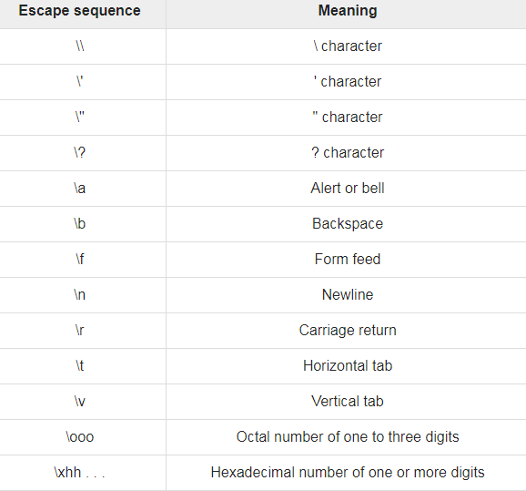

# Go Constants

### Contants

- immutable values
- literals  whose values cannot be modified
- instead of var use constant
- `const <constant_name> = value`

```go
package main 
import "fmt"
func main(){
	const x string = "Hello World"
  fmt.Println(x)
}
```

---

### Go Escape Sequence

- special string for representing actions
- newline,carriage returns, tab movements and non printing
- 


---
