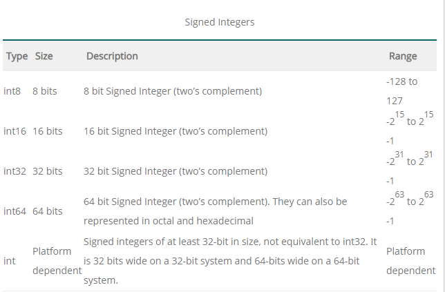

# Go DataTypes

### Data Types

- represent different types of data
- Examples of Golang Data types : int,float,struct,slice,interface
- Syntax  `var <name> <tag> / var <name> <tag> = <expression>`
- Built in data types :
    - Numbers
        - int, unit ,byte,rune,uintptr
     

     
	
     


    - Float :
        - used to store decimal points
        - supports float32v and float64
        - untyped floating point is considered as float64

        ```go
        var num1 flaot32 = 10.2587
        var num2 = 5041.3583 // Type inferred as float64
        ```

    - Complex numbers :
        - Numbers with imaginary parts (a+bi) a→ real b→ imaginary
        - supports  complex64 (uses float32) and complex128 (uses float64)

        ```go
        var num1 = 3+7i // Type inferred as complex128
        ```

    - Boolean :
        - represents the truth value
        - can be either True or False
        - commonly used in decision making statements

        ```go
        package main 
        import "fmt"
        func main(){
        	var flag = true
        	fmt.Println(flag)
        } //Output: true 
        ```

    - String :
        - used to hold series or sequence of characters - letters,numbers,special characters
        - cannot be changed once assigned
        - declared using double quotes or back ticks

        ```go
        // It does not allows newline, 
        //and can contain escape sequences
        var str = "Hello World"

        //Can span multiple lines.
        //Escape characters are not allowed 
        var str1 = `Hello World, this a 
        multi-line text string`. 

        ```

---

### Practice Code

[https://play.golang.org/p/lZI24QXsAHl](https://play.golang.org/p/lZI24QXsAHl)

<h4 align="left">
<p> 
   <a href="https://github.com/ZephyrAveryl777/Golang-Notes/blob/main/Variables/Go%20Variablesd"> Previous: Go Variables</a>
   </p>
</h4>


<h4 align="right">
<p>
<a href="https://github.com/ZephyrAveryl777/Golang-Notes/blob/main/Operators/Go%20Operators.md">Next: Go Operators </a>
<p>
</h4>
