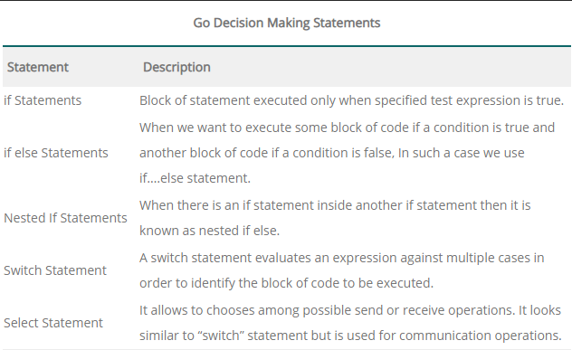

# Go Decision Making

### Decision Making Statement

- specify one or more conditions to be evaluated or tested by the program,




---

### Go If

- used to test the condition
- If it evaluates to true, the body of the statement is executed. If it evaluates to false, if block is skipped.

```go
//Syntax of If 
if(boolean_expression){
	/*statement(s) got executed only 
	if the expression results in true*/
}
```

[https://play.golang.org/p/a6PrYdagdxN](https://play.golang.org/p/a6PrYdagdxN)

---

### Go if-else

- used to test condition
- If condition is true, if block is executed otherwise else block is executed.

```go
//Syntax 
if(boolean_expression) {  
   /* statement(s) got executed only if
	 the expression results in true */  
} else {  
   /* statement(s) got executed only if
	 the expression results in false */  
}
```

[https://play.golang.org/p/a8WsoQ8r03A](https://play.golang.org/p/a8WsoQ8r03A)

[https://play.golang.org/p/-PUO20JUUR6](https://play.golang.org/p/-PUO20JUUR6)

---

### Go if else if chain

- execute one statement from multiple conditions
- can have N numbers of if-else statement.

[https://play.golang.org/p/ZMV0ZkLxRxJ](https://play.golang.org/p/ZMV0ZkLxRxJ)

---

### Go Nested if-else

- nest the if-else statement to execute one statement from multiple conditions.

```go
if( boolean_expression 1) {  
    /* statement(s) got executed only 
	if the expression 1 results in true */  
   if(boolean_expression 2) {  
    /* statement(s) got executed only 
	if the expression 2 results in true */  
   }  
}
```

[https://play.golang.org/p/15wWav7vZec](https://play.golang.org/p/15wWav7vZec)

---

### Go Switch

- executes one statement from multiple conditions
- more than one values can be tested in a case
- If any case is matched, the corresponding case statement is executed
- In Golang the break keyword is implicit
- **Fall-through:  used to transfer control to the first statement of the case that is present immediately after the case which has been executed**


```go
switch  var1 {  
case val1:  
.....  
case val2  
.....  
default:  
.....  
}
```

[https://play.golang.org/p/fCzGBDApCAP](https://play.golang.org/p/fCzGBDApCAP)

- Multiple case Switch case

[https://play.golang.org/p/Xq1SV_ODhFw](https://play.golang.org/p/Xq1SV_ODhFw)

- fallthrough statement allows to execute all the following statements after a match found

[https://play.golang.org/p/LvaF8lU18WN](https://play.golang.org/p/LvaF8lU18WN)

- switch with short declaration

[https://play.golang.org/p/BZuC8Mb7OQb](https://play.golang.org/p/BZuC8Mb7OQb)

- switch with no expression

[https://play.golang.org/p/56a931bLvFl](https://play.golang.org/p/56a931bLvFl)

---

### Go Select

- similar to switch
- used in to communicate with operations

```go
//Syntax
select {
   case communication clause  :
      statement(s);      
   case communication clause  :
      statement(s); 
   /* you can have any number of case statements */
   default : /* Optional */
      statement(s);
}
```

[https://play.golang.org/p/prHpkyL8F6c](https://play.golang.org/p/prHpkyL8F6c)

---
