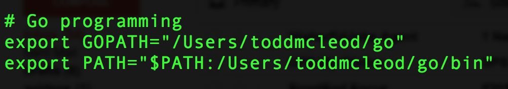

# Installing Go

### Key Points

1. download go
2. go commands (most common and important to check the install)
    - go version
    - go env
    - go help
3. checksum 
- Installation process - video from YouTube.

---

### Go modules intro

Starting in Go 1.13, module mode will be the default for all development. Here is what this means.

- version go 1. 13
- surf Google to learn more

---

### Go Workspace

- one folder - any name, any location
    - bin
    - pkg
    - src
        - [github.com](http://github.com) (linking github repo to project if needed)
            - <github.com username>
                - folder with code for project / 	repo
                - (repeat same steps for huge project branches)
- name spacing
- go get
    - package mangement
- GOPATH
    - points to your GO workspace
- GOROOT
    - points to your binary installation of GO
- Refer to Google for further information

---

### Environment variables

- Environment variables, set of dynamic named values that can affect the way running processes will run on a machine
- part of Environment in which a process runs
- .bash_profile & .bashrc
    - .bash_profile is executed for login shells, while .bashrc is executed for
    interactive non-login shells. When you login (type username and password) via
    console, either sitting at the machine, or remotely via ssh: .bash_profile is
    executed to configure your shell before the initial command prompt. (Mostly used in Linux and Mac Os)
    **Example**
    
    
    
---

### IDE's  ⇒ Integrated Development  Environment

- VS Code
- GoLand
- Atom.io
- Sublime

**Most popular ones :**

- GoLand
    - https://www.jetbrains.com/go/
    - a Programming Font (search Google) for better comfort
    - a custom settings of IDE
- VS Code
    - https://code.visualstudio.com/
    - Open sourced and fast with lot of community support
    - refer [https://code.visualstudio.com/docs/languages/go](https://code.visualstudio.com/docs/languages/go) or YouTube for further understanding

---

### Important GO commands

- go version
- go env
- go help
- go fmt
- go run
    - needs a file name, Example: go run main.go
    - go run <file name>
    - go run *.go
- go build
    - for an executable:
        - builds the file
        - reports errors, if any
        - if there are no errors, it puts an executable into the current folder
    - for a package:
        - builds the file
        - reports errors
        - throws away binary
- go install
    - for an executable:
        - builds the file
        - names the executable
            - Mac : the folder name holding the code
            - Windows : file name
        - puts the executable path in **workspace/bin**
            - $GOPATH/bin
    - for a package:
        - builds the file
        - puts the executable path in **workspace/bin**
            - $GOPATH/pkg
        - makes it an archive file
- flags
    - -race

---

### Package Management

When creating software today, you can use code that other people have written. You can call this other code packages, module, libraries, or dependencies. If you use other people’s code in your code, then your code is dependent upon other people’s code. Your code now has dependencies. Managing these packages / libraries / modules / dependencies (call it what
you will) is what package management is all about.

 Example NPM,YARN etc. 

---

### Go Modules

You create a go module “workspace” using this command:

- go mod init [example.com/hello](http://example.com/hello)
- [example.com/hello](http://example.com/hello) is just a text, any text can be placed here

**Adding  a dependency** 

- You can add a dependency by importing a third-party package.
- To see all of the dependencies,
use this command :
    - go list -m all

**Upgrading dependencies**

- You can upgrade dependencies, and also specify specific versions, of software that your code
depends on.
    - grabs latest versions of imports
    - to get a specific version use "@" in your go get
        - for instance : go get github.com/Me2/mux@v.1.8
    - @ will support :
        - release version
        - branch
        - commit(s)
- to view all dependencies
    - go list -m -version <import> (Refer Google)

---
