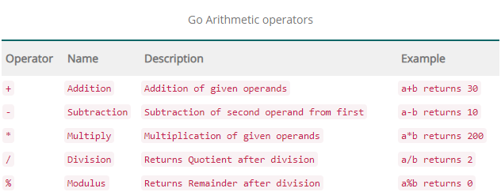

# Go Operators

### Short declaration operator

- terminology
    - keywords :
        - these are words that a reserved for use by the Go programming language
            - they are sometimes called "reserved words"
            - you can't use a keyword for anything other than its purpose
    - operator :
        - in "2+2" the "+"is the operator
        - an operator is a character that represents an action as for "+" represents addition
    - operand :
        - in "2+2" the "2's are operands
    - statement :
        - In programming a statement is the smallest standalone element of a program that expresses some action to be carried out. Its an instruction that commands the computer to perform a specified action. A program is formed by a sequence of one or more statements.
    - expressions :
        - is a combination of one or more explicit values, constants, variables, operators  and functions that the programming language interprets and computes to produce another value Example 2+3 = 5

---

### Type of operators in Go Programming

- Arithmetic Operators



```go
package main 
import "fmt"
func main(){
	var a int = 20 
	var b int = 10
	fmt.Println("Go Arithmetic Operator")
	fmt.Println(a+b)
	fmt.Println(a-b)
	fmt.Println(a*b)
	fmt.Println(a/b)
	fmt.Println(a%b)
}
```

- Assignment Operators


```go
package main
import "fmt"
func main(){
	var a int = 30 
	var b int = 5
	fmt.Printf("Assignment Operators")
	a+=b
	fmt.Printf("a+=b :%d\n", a)
	a-=b
	fmt.Printf("a-=b :%d\n", a)
	a*=b
	fmt.Printf("a*=b :%d\n", a)
	a/=b 
	fmt.Printf("a/=b :%d\n", a)
	a%=b
	fmt.Printf("a%%=b :%d\n", a)
}
```

- Comparison (Relational) Operators


```go
package main
import "fmt"
func main(){
	 var a int = 20
	 var b int = 10
	 if (a>b){
			fmt.Println("Go Relatational Operators")
			fmt.Println("a is greater than b")
		}
		else {
			fmt.Println("b is greater than a")
  }
}
```

- Logical Operators


```go
package main 
import "fmt"
func main(){
	var a int=20
	var b int=10
	var c int=25
	var flag bool = false
	var result bool
	fmt.Println("Go Logical Operator")
	result = (a>b) && (a<c)
	fmt.Printf("(a>b) && (a<c) :%t\n",result)
	result = (a>b) || (a>c)
	fmt.Printf("(a>b) || (a>c) :%t\n",result)
	result = !flag
	fmt.Printf("!flag :%t\n",result)
} 
```

- Bit wise Operators


```go
package main
import "fmt"
func main(){
	var a,b,c int
	a = 50
	b =10
	c = a & b 
	fmt.Println(c)
	c = a | b
	fmt.Println(c)
	c = a ^ b
	fmt.Println(c)
	c = a &^ b
	fmt.Println(c)
}
```

- Other Operators


---
<h4 align="left">
<p> 
   <a href="https://github.com/ZephyrAveryl777/Golang-Notes/blob/main/Data%20Types/Go%20Datatypes.md"> Previous: Go DataTypes</a>
   </p>
</h4>


<h4 align="right">
<p>
<a href="https://github.com/ZephyrAveryl777/Golang-Notes/blob/main/Constants/Go%20Constants.md">Next: Go Constants </a>
<p>
</h4>
